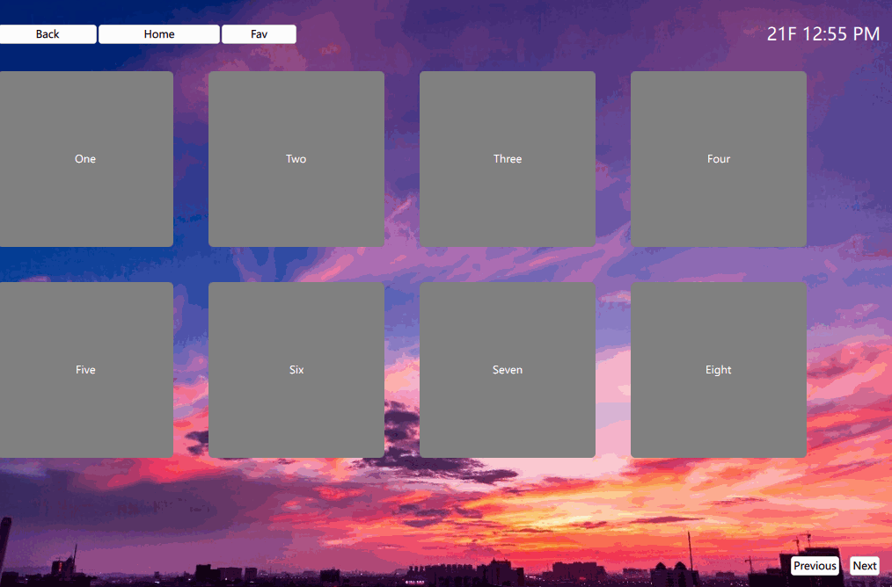

- [[#信号/信号槽|信号/信号槽]]
- [[#Qt Quick引入自己写的类|Qt Quick引入自己写的类]]
- [[#QML联合C++中的信号|QML联合C++中的信号]]
- [[#使用定时器|使用定时器]]
- [[#网格布局|网格布局]]
- [[#页面切换|页面切换]]


在很多时候设置居中，margin之类属性的时候，如果没有效果，可以看看是否是没有设置这个元素的宽度或者是高度。


总体来说就是设置锚点，与父元素相关的位移和对应，

```cpp
Rectangle{
    id: bottomBar
    signal iconClicked(int iconIndex) // 定义信号，传递图标的索引

    anchors{
        left: parent.left
        right: parent.right
        bottom: parent.bottom
    }
    color:"black"
    height: parent.height/12
}
```
`anchors`里还有`leftMargin`，`verticalCenter`等等属性词，都是可以见名思义的。

# 信号/信号槽
要设置点击某处，另一处出现效果，可以设置信号和信号槽
```cpp
import QtQuick 2.15
import QtQuick.Controls 2.15 //为了在qt quick中引入信号

Rectangle{
    id: bottomBar
    signal iconClicked(int iconIndex) // 定义信号，传递图标的索引
    
	Image {
	MouseArea{
            onClicked: iconClicked(0)
        }
    }
}
```
然后在信号槽部分是使用 `on<信号名>` 的格式
```cpp
BottomBar{
		property int currentIndex: 0 // 当前显示的索引
        id: bottomBar
        // 连接信号到槽函数
        onIconClicked: {
            currentIndex = iconIndex
        }
    }
```


# Qt Quick引入自己写的类
自己写的类包含了处理逻辑，那么需要在主代码中引入。
在`main.cpp`中，使用
```cpp
#include<Controllers/system.h> //这个是自己写的代码
#include<QQmlContext>

int main(int argc, char *argv[])
{
 // 。。。其他内容
System m_systemHandler;//自己写的类
QQmlContext * context(engine.rootContext());
context->setContextProperty("systemHandler",&m_systemHandler);

}
```
这样就可以在qml文件里面使用`systemHandler`这个属性。
使用时大概这样：
```cpp
source: (systemHandler.carLocked )? "qrc:/ui/assets/lock.png":"qrc:/ui/assets/unlock.png"
```
上面是调用自己类的属性，下面是调用自己类的方法`setCarLocked()`：
```cpp
MouseArea{
    anchors.fill: parent
    onClicked: systemHandler.setCarLocked(!systemHandler.carLocked)
}
```
\
> 但是要注意！！！ 如果要这样调用的话必须在定义这个方法的前面加上`Q_INVOKABLE`！！！如下
```cpp
class System : public QObject
{
public:
	Q_INVOKABLE void setCarLocked(bool newCarLocked);
}
```


# QML联合C++中的信号
之前讲了信号和信号槽都定义在`qml`文件里面的用法，下面讲一下如何在qml中使用C++文件里的信号
首先c++文件中定义
```cpp
class AudioController : public QObject
{
	signals:
	    void volumeLevelChanged();
}
```
然后引入到Qt quick中，
```cpp
engine.rootContext()->setContextProperty("audioController",&m_audioController);
```
`Connections` 元素允许我们将信号与槽函数连接，即在指定信号发出时执行特定的代码块。
`target` 指定了信号的发送者，`audioController` 就是上面的对象，它有一个 `volumeLevelChanged` 信号。
`function onVolumeLevelChanged()` 定义了一个槽函数，当 `volumeLevelChanged` 信号被触发时，这个函数会被调用。
```cpp
Connections{
        target: audioController
        function onVolumeLevelChanged(){
            visibleTimer.stop()
            volumeIcon.visible = false
            visibleTimer.start()
        }
}
```


# 使用定时器
```cpp
Timer{
        id: visibleTimer
        interval: 500
        repeat: false
        onTriggered: {
            volumeIcon.visible=true
    }
}
```
在使用时是这样的：
```cpp
visibleTimer.stop()
visibleTimer.start()
```

# 网格布局
要实现下面动图的八个格子的那种页面，主要使用`GridView` 
`GridView` 是 QML 中用于实现网格布局的一种视图组件。`GridView` 通过 `model` 属性与数据模型连接，使用 `delegate` 来定义每个网格单元的显示方式。
```cpp
ListModel{
        id: listModel
        ListElement{name:"One"; page:"StationPage.qml"}
        ListElement{name:"Two"; page:""}
        ListElement{name:"Three"; page:""}
        ListElement{name:"Four"; page:""}
        ListElement{name:"Five"; page:""}
        ListElement{name:"Six"; page:""}
        ListElement{name:"Seven"; page:""}
        ListElement{name:"Eight"; page:""}
    }
    GridView{
        id: gridView
        anchors.fill: parent
        model: listModel
        cellHeight: 240
        cellWidth: 240
        delegate: Rectangle{
            width: 200
            height: 200
            color: "grey"
            radius: 5
            Text {
                color: "white"
                text: name
                anchors.centerIn: parent
            }
            MouseArea{
                anchors.fill: parent
                //onClicked: mainLoader.source = page
                onClicked: stackview.push(page)
            }
        }
    }
```
`GridView` 是根据提供的 `cellWidth` 和 `cellHeight` 属性来排列内容，使得每个项目都以网格的形式展示。`delegate` 属性定义了如何呈现每个数据项。
这个类适合用于显示类似图片库、商品列表、图标面板等需要网格布局的数据集合


# 页面切换
要实现下面这样的效果，另一种粗暴的切换方式`Loader`,没有切换动画，就不讲了。

实现这个，主要是`import QtQuick.Controls`里的`StackView`这个类。
然后切换前是不同的页面，是使用**独立的 QML 文件**或 QML 组件来代表不同的页面。
但是前面简单的放一下Loader也行
```cpp
StatusBar{
        id: statusBar
}
Loader{
        id: mainLoader
        anchors{
            left: parent.left
            right: parent.right
            top :statusBar.bottom
            bottom: parent.bottom
        }
        source:"StackViewPage.qml"
    }
```
这种就是主要用于切换也只切换部分页面。

首先需要设置 `StackView` 的初始页面，使用 `initialItem` 属性
```cpp
StackView{
        id: stackview
        anchors.fill: parent
        initialItem: "GridOne.qml"
}
```
这里的`GridOne.qml`就是上面的8个格子的页面

然后在`GridOne.qml`要设置切换的方法，如下
```cpp
Button{
        id: nextButton
        anchors{
            right: parent.right
            bottom: parent.bottom
            margins: 20
        }
        text:"Next"
        onClicked: stackview.push("GridTwo.qml")
}
```
在执行`stackview.push("GridTwo.qml")`之后，页面会切换到`GridTwo`的页面,然后栈里面存着`GridOne.qml`，在新页面要返回旧页面，也是进行栈的操作，但是是弹出：
```cpp
Button{
        id: previousButton
        anchors{
            right: nextButton.left
            rightMargin: 10
            verticalCenter: nextButton.verticalCenter
        }
        text:"Previous"
        onClicked: stackview.pop("GridTwo.qml")
    }
```
就是把自己这个页面弹出，返回栈中的上个页面


